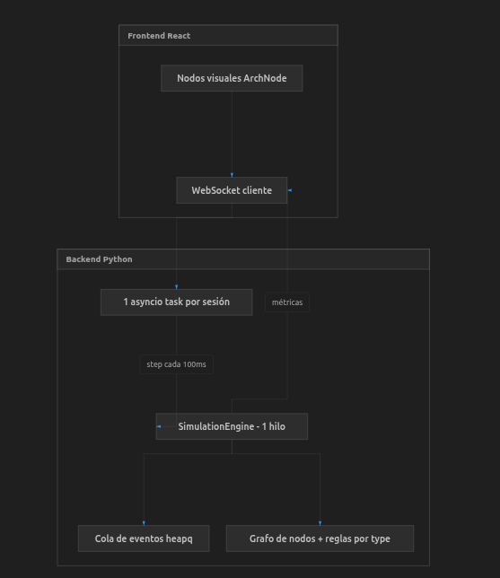

# SANE — Software Architecture Node Emulator

Emulador visual de arquitecturas de software. Diseña diagramas con drag & drop, configura parámetros por componente y ejecuta simulaciones de tráfico para observar cómo se comporta tu arquitectura.

## Características

- **Lienzo interactivo** con drag & drop de componentes
- **Instancias ilimitadas** de cada tipo de elemento
- **Menú contextual** (clic derecho) con parámetros específicos por componente
- **Conexiones spline** entre puertos de entrada/salida que se actualizan al mover nodos
- **Catálogo rico** con 25+ componentes: usuarios, balanceadores, servidores web, BBDD, Redis, Celery, Kafka, CDN, WAF, etc.
- **Modo Play** con simulación por eventos discretos y métricas en tiempo real

## Inicio rápido

### Con Docker (recomendado)

Solo necesitas [Docker](https://docs.docker.com/get-docker/) y Docker Compose.

```bash
docker compose up --build
```

Abre `http://localhost:8000`. La imagen construye el frontend y arranca el backend en un solo contenedor.

### Instalación local

#### Requisitos

- Python 3.11+
- [Poetry](https://python-poetry.org/)
- Node.js 18+

#### Backend

```bash
cd /home/daniel/proyectos/sae
poetry install
poetry run sae
```

El API estará en `http://localhost:8000`.

#### Frontend (desarrollo)

```bash
cd frontend
npm install
npm run dev
```

Abre `http://localhost:5173`.

## Uso

### Diseñar una arquitectura

1. Arrastra componentes desde la paleta izquierda al lienzo
2. Conecta la **salida** de un nodo con la **entrada** de otro (arrastra desde los puntos laterales)
3. Clic derecho en un nodo para abrir su menú de parámetros

### Ejemplo: Balanceador de carga

```
[Usuario] → [Balanceador] → [Servidor Web 1]
                           → [Servidor Web 2]
                           → [Servidor Web 3]
```

1. Arrastra un **Usuario** y configúralo: `10 peticiones/seg`
2. Arrastra un **Balanceador** con algoritmo `round_robin`
3. Arrastra 3 **Servidor Web** con distintos tiempos de proceso
4. Conecta: Usuario → Balanceador → cada Servidor Web
5. Pulsa **▶ Play** y observa la distribución en el panel derecho

### Parámetros destacados por componente

| Componente    | Parámetros                                                          |
| ------------- | ------------------------------------------------------------------- |
| Usuario       | peticiones/seg, ráfaga, think time                                  |
| Balanceador   | algoritmo (round_robin, least_connections, random...), health check |
| Servidor Web  | workers, tiempo proceso, cola máx, tasa error                       |
| Base de Datos | tiempo query, pool conexiones, slow query threshold                 |
| Cola Celery   | workers, tiempo encolado, tiempo tarea, prefetch                    |
| Redis         | hit ratio, latencia GET/SET, eviction policy                        |
| CDN           | hit ratio, latencia edge/origen                                     |

## Motor de simulación

Los componentes del diagrama **no son procesos ni threads independientes**. El frontend solo los representa visualmente; la lógica vive en un único motor de simulación por eventos discretos (DES) en Python.



### Frontend: representación visual

Cada nodo del lienzo es un componente React (`ArchNode`) dibujado con React Flow. Muestra icono, etiqueta, puertos de conexión y, durante la simulación, métricas recibidas del backend (`requests_received`, latencia media, carga, etc.). No ejecuta lógica de simulación.

### Backend: un motor, una cola de eventos

El `SimulationEngine` (`sae/simulation/engine.py`) mantiene:

- Un **reloj global** (`clock`)
- Una **cola de prioridad** (`heapq`) con eventos ordenados por tiempo
- Un **grafo de conexiones** derivado del diagrama
- **Estado compartido** por nodo (colas, workers ocupados, estado del balanceador)

Los eventos se procesan **uno a uno, en orden temporal**. No hay paralelismo real entre componentes; la concurrencia se modela con tiempos de espera, colas y contadores.

Tipos de evento:

| Evento             | Descripción                                        |
| ------------------ | -------------------------------------------------- |
| `generate_request` | Un nodo `user` genera peticiones periódicas        |
| `cron_trigger`     | Un `cron_job` dispara una tarea                    |
| `arrive`           | Una petición llega a un nodo                       |
| `process_complete` | Un nodo termina de procesar y reenvía al siguiente |

### Comportamiento de cada componente

Cada ítem del diagrama se modela por su **`type`** y sus **`parameters`**, no por una clase o thread propio. Al llegar una petición (`arrive`), el motor calcula un tiempo de procesamiento según el tipo (`microservice`, `rabbitmq`, `database`, `load_balancer`, etc.) y programa un `process_complete` en el futuro. Al completar, reenvía la petición a los nodos conectados por salida.

Ejemplo (`async-workers`):

```
[Cron Job] → [RabbitMQ] → [Worker 1/2] → [PostgreSQL]
```

1. El cron programa un `cron_trigger` periódico
2. Se crea una petición y llega a RabbitMQ (`arrive`)
3. Se calcula latencia según parámetros del nodo
4. Al completar, la petición pasa a los workers conectados
5. Si no hay más conexiones, la petición se marca como completada

### Rol de asyncio

`asyncio` solo se usa en la capa WebSocket (`sae/api/websocket.py`): una tarea por sesión llama a `engine.step()` cada ~100 ms y envía métricas al frontend. Sirve para no bloquear el servidor y actualizar la UI; **no** crea una coroutine ni un thread por componente del diagrama.

### Resumen

| Pregunta                        | Respuesta                                           |
| ------------------------------- | --------------------------------------------------- |
| ¿Hay un thread por nodo?        | No                                                  |
| ¿Hay paralelismo real?          | No; simulación secuencial por eventos               |
| ¿Qué gobierna cada ítem?        | Su `type`, parámetros y posición en el grafo        |
| ¿Cómo se simulan colas/workers? | Tiempos de espera, `_server_busy`, `_server_queues` |
| ¿Qué hace asyncio?              | Orquestar el loop de simulación y el WebSocket      |

## Arquitectura del proyecto

```
sae/
├── sae/                    # Backend Python
│   ├── catalog/            # Definiciones de componentes
│   ├── simulation/         # Motor de eventos discretos
│   ├── api/                # REST + WebSocket
│   └── models/             # Modelos Pydantic
├── frontend/               # React + React Flow
│   └── src/
│       ├── components/     # Canvas, Palette, ContextMenu, etc.
│       └── types/
└── pyproject.toml
```

## API

| Endpoint                    | Descripción                                     |
| --------------------------- | ----------------------------------------------- |
| `GET /api/catalog`          | Catálogo de componentes agrupados por categoría |
| `GET /api/catalog/{type}`   | Definición de un componente                     |
| `POST /api/canvas/validate` | Valida un diagrama                              |
| `WS /ws/simulation`         | Simulación en tiempo real                       |

## Producción

```bash
cd frontend && npm run build
cd .. && poetry run sae
```

FastAPI sirve el frontend compilado desde `frontend/dist/`.

## Snapshots

### API con base de datos


### Eventos con Kafka


### Balanceador con réplicas


### SaaS multi-región alta disponibilidad


### Pipeline de datos en streaming


### Menú contextual de parámetros


### Simulación en curso


